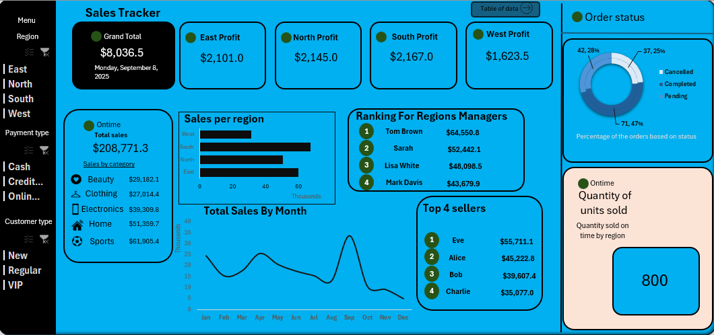

# Sales Tracker Dashboard

## Main KPIs

- **Total Sales** – Tracks the overall revenue generated.  
- **Regional Profits** – Profit contribution from East, North, South, and West regions.  
- **Sales by Category** – Breakdown of sales across Beauty, Clothing, Electronics, Home, and Sports.  
- **Sales per Region** – Distribution of sales volume across geographic regions.  
- **Top Managers Performance** – Ranking of regional managers based on sales contribution.  
- **Top Sellers Performance** – Ranking of individual sellers based on sales performance.  
- **Sales Trend (Monthly)** – Tracks sales growth and seasonality across months.  
- **Order Status** – Percentage of orders completed, pending, or cancelled.  
- **Units Sold (On-time)** – Number of units delivered within the expected timeframe.  

---

## Dashboard Filters (Slicers)
- **Region:** East | North | South | West  
- **Payment Type:** Cash | Credit | Online  
- **Customer Type:** New | Regular | VIP  

